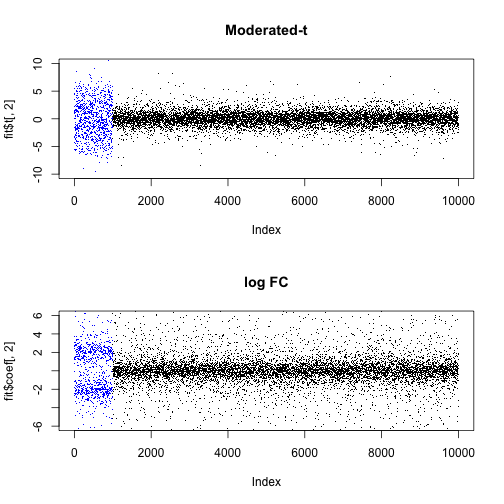

The purpose of this exercise is to simulate some "microarray" data and explore how well different statistical tests separate truly differential expression (in a small sample situation).  This will introduce you to: i) simulation; ii) metrics to assess statistical performance; iii) some variations of the t-test.

Specifically, we will create a synthetic dataset with replicates from 2 experimental conditions and put in differential expression for some features. The goal is to see how well different statistical summaries can distinguish between those "truly" differential and those not differential.

Below is some R code to get you started.


```r
library("limma")
```

Next, we set some parameters for the simulation.  You will modify these to explore a few situations.


```r
nGenes <- 10000                   # number of "features"
nSamples <- 6                     # number of samples (split equal in 2 groups)
pDiff <- .1                       # percent of genes "differential 
grp <- rep(0:1,each=nSamples/2)   # dummy variable for exp. group
trueFC <- 2                       # log-fold-change of truly DE

d0 <- 1
s0 <- 0.8
sd <- s0*sqrt(d0/rchisq(nGenes,df=d0))  # dist'n of s.d.
```

Note: there are some details regarding the scaled inverse chi-square distribution that you may want to explore.  For example, see the [wiki description](http://en.wikipedia.org/wiki/Scaled_inverse_chi-square_distribution). 

#### Question 1. Look at the distribution of "true" s.d. (each gene has a different s.d.).  You will change this distribution later to see effect on differential detection performance.


Next, we can generate a table of (null) data:


```r
y <- matrix(rnorm(nGenes*nSamples,sd=sd),
            nr=nGenes,nc=nSamples)
```

And, we can add in "differential expression", randomly chosen to be in the positive or negative direction, to a set of indices chosen:


```r
indD <- 1:floor(pDiff*nGenes)
diff <- sample(c(-1,1),max(indD),replace=TRUE)*trueFC
y[indD,grp==1] <- y[indD,grp==1] + diff
```

#### Question 2. To make sure you understand the simulation, look at some of the rows in the table.  For example, plot the data (e.g., a barplot) for one of the features that is differential and one that is non-differential.

Next, we create a design matrix to feed into limma:


```r
design <- model.matrix(~grp)
```

#### Question 3. What is the interpretation of the two columns of this design matrix?

Below is a standard limma pipeline.  We will unravel many details of these steps in the coming weeks.


```r
fit <- lmFit(y,design)
fit <- eBayes(fit)
```

#### Question 4. For each row in the simulated table, calculate the classical 2-sample t-test (perhaps store the result in a vector named 'classicalt'; see below).  See ?t.test for more details about the built-in R function to do this calculation and convince yourself which arguments to use to match the t-test described in class.


Below, a vector of colours is made to signify the true differential "status", which will be used in exploratory plots:


```r
cols <- rep("black",nrow(y))
cols[indD] <- "blue"

par(mfrow=c(2,1))
plot( fit$t[,2], col=cols, ylim=c(-10,10), pch=".", main="Moderated-t" )
plot( fit$coef[,2], col=cols, ylim=c(-6,6), pch=".", main="log FC" )
```

 


#### Question 5. Add an exploratory visualization to your plots above, perhaps with a command similar to below.  From this visualization, summarize any differences you see between the three statistical summaries of a change between experimental groups.


```r
plot( classicalt, col=cols, ylim=c(-10,10), pch=".", main="Classical-t" )
```


#### Question 6. Pick a reasonable metric to compare the methods: ROC curve, false discovery plot, power versus achieved FDR.  Using this metric/curve, compare the classical t-test (classicalt), the moderated t-test (fit\$t) and the log-fold-change or mean difference (fit\$coef).  Either manually calculate and plot it or use a nice package for it (e.g., [https://rocr.bioinf.mpi-sb.mpg.de/](the ROCR package))  What method(s) perform well?


#### Question 7.  Explore the performance of these test statistics for a few scenarios.  For example, change the sample size, the number of genes DE, magnitude of the difference, level of variability.  What influence do these parameters have on the relative performance? 


#### Note: Submit both an Rmarkdown/markdown file as well as a compiled HTML file to your private github repository.
